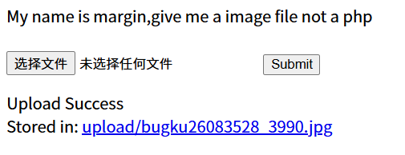
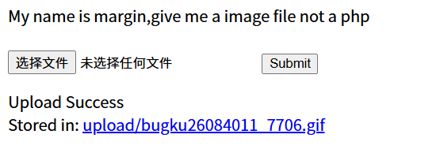
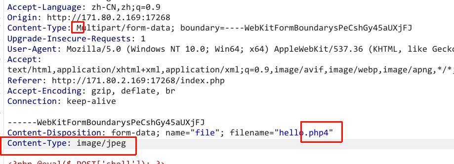

# Content-Type大小写绕过+php后缀检测绕过

[题目链接](https://ctf.bugku.com/challenges/detail/id/104.html)

## 过程

题目要求上传图片而不是php文件。先上传一张图片试试。



文件名字被重新命名了，这意味着上传 `htacess` `.user.ini` 配置文件可能不可行。

似乎文件的后缀还是保留的，是否有可能上传php文件？接着上传另一种图片后缀的文件




可以看到gif的后缀也保留了，尝试一下上传php文件。
首先上传php文件，然后修改body里的Content-Type为图片。
尝试了 `php` `php4` `phtml` 都被拦截了，大小写混用也被拦截。

有没有办法绕过检测呢？服务器接收到用户发来的http请求，可能会进入某个分支来检测我们上传的文件，如果不让他进入检测的分支，或许可以跳过检测。

修改 Header 里的 Content-Type 为大小写混用，然后上传php4文件




这次就上传成功了，flag就在根目录。
不过，我们可以看看题目的源代码。

`index.php`

```php
<html>
<body>
<?php 
$flag = "flag{test}"
?>
<form action="index.php" method="post" enctype="multipart/form-data">
My name is margin,give me a image file not a php<br>
<br>
<input type="file" name="file" id="file" /> 
<input type="submit" name="submit" value="Submit" />
</form>
<?php
function global_filter(){
	$type =  $_SERVER["CONTENT_TYPE"];
	if (strpos($type,"multipart/form-data") !== False){
		$file_ext =  substr($_FILES["file"]["name"], strrpos($_FILES["file"]["name"], '.')+1);
        $file_ext = strtolower($file_ext);
		if (stripos($file_ext,"php") !== False){
			die("Invalid File<br />");
		}
	}
}
?>


<?php

global_filter();
if ((stripos($_FILES["file"]["type"],'image')!== False) && ($_FILES["file"]["size"] < 10*1024*1024)){
	if ($_FILES["file"]["error"] == 0){
		$file_ext =  substr($_FILES["file"]["name"], strrpos($_FILES["file"]["name"], '.')+1);
        $file_ext = strtolower($file_ext);
        $allowexts = array('jpg','gif','jpeg','bmp','php4');
        if(!in_array($file_ext,$allowexts)){
            die("give me a image file not a php");
        }
		$_FILES["file"]["name"]="bugku".date('dHis')."_".rand(1000,9999).".".$file_ext;

	    if (file_exists("upload/" . $_FILES["file"]["name"])){
	    	echo $_FILES["file"]["name"] . " already exists. <br />";
	    }
	    else{
	    	if (!file_exists('./upload/')){
	    		mkdir ("./upload/");
                system("chmod 777 /var/www/html/upload");
	    	}
	    	move_uploaded_file($_FILES["file"]["tmp_name"],"upload/" . $_FILES["file"]["name"]);
                echo "Upload Success<br>";
                $filepath = "upload/" . $_FILES["file"]["name"];
	      	echo "Stored in: " ."<a href='" . $filepath . "' target='_blank'>" . $filepath . "<br />";
	    }
	}
}
else{
	if($_FILES["file"]["size"] > 0){
		echo "You was catched! :) <br />";
	}
}
?>
</body>
</html>
```

```php
<html>
<body>
<?php 
$flag = "flag{test}" // 最终目标：执行代码获取这个变量
?>
<form action="index.php" method="post" enctype="multipart/form-data">
My name is margin,give me a image file not a php<br>
<br>
<input type="file" name="file" id="file" /> 
<input type="submit" name="submit" value="Submit" />
</form>

<?php
/**
 * 第一层防御：全局过滤器
 * 这里的逻辑存在经典的“大小写绕过”漏洞
 */
function global_filter(){
    // 获取 HTTP 请求头的 Content-Type
    $type =  $_SERVER["CONTENT_TYPE"];
    
    // 【漏洞点 1】strpos 是大小写敏感的。
    // 如果我们将请求头改为 "Multipart/form-data"，这个 if 就会直接跳过，
    // 从而绕过内部所有的 PHP 后缀检查。
    if (strpos($type,"multipart/form-data") !== False){
        // 获取后缀名
        $file_ext =  substr($_FILES["file"]["name"], strrpos($_FILES["file"]["name"], '.')+1);
        $file_ext = strtolower($file_ext);
        
        // 检查后缀是否包含 php
        if (stripos($file_ext,"php") !== False){
            die("Invalid File<br />");
        }
    }
}

// 执行全局过滤
global_filter();

/**
 * 第二层防御：MIME 类型与白名单检查
 */
// 检查浏览器发送的 MIME 类型是否包含 'image'（可通过抓包修改）
if ((stripos($_FILES["file"]["type"],'image')!== False) && ($_FILES["file"]["size"] < 10*1024*1024)){
    if ($_FILES["file"]["error"] == 0){
        // 再次获取后缀并转为小写
        $file_ext =  substr($_FILES["file"]["name"], strrpos($_FILES["file"]["name"], '.')+1);
        $file_ext = strtolower($file_ext);
        
        // 【核心考点】允许的后缀白名单
        // 注意：这里竟然允许上传 'php4' 后缀的文件！
        $allowexts = array('jpg','gif','jpeg','bmp','php4');
        
        if(!in_array($file_ext,$allowexts)){
            die("give me a image file not a php");
        }

        // 重命名文件：bugku + 日期时间 + 随机数，防止文件名冲突或直接猜测
        $_FILES["file"]["name"]="bugku".date('dHis')."_".rand(1000,9999).".".$file_ext;

        if (file_exists("upload/" . $_FILES["file"]["name"])){
            echo $_FILES["file"]["name"] . " already exists. <br />";
        }
        else{
            // 如果 upload 目录不存在则创建并给 777 高权限
            if (!file_exists('./upload/')){
                mkdir ("./upload/");
                system("chmod 777 /var/www/html/upload");
            }
            // 移动临时文件到正式目录
            move_uploaded_file($_FILES["file"]["tmp_name"],"upload/" . $_FILES["file"]["name"]);
            echo "Upload Success<br>";
            $filepath = "upload/" . $_FILES["file"]["name"];
            // 输出存储路径，方便攻击者（你）访问
            echo "Stored in: " ."<a href='" . $filepath . "' target='_blank'>" . $filepath . "<br />";
        }
    }
}
else{
    if($_FILES["file"]["size"] > 0){
        echo "You was catched! :) <br />";
    }
}
?>
</body>
</html>
```

可以看出来绕过了绕过了第一层仍然不能直接上传 `php` 文件，不过出题人运行了上传 `.php4` 还给了上传目录777权限。

明显这道题想考**大小写绕过**和**后缀绕过**，但是感觉太隐蔽了，而且怎么只有php4文件能够上传。

## 总结

新增绕过思路 
- 尝试跳出当前判断分支
- 大小写绕过
- 各种php后缀绕过：`php` `php[347]` `phtml`
